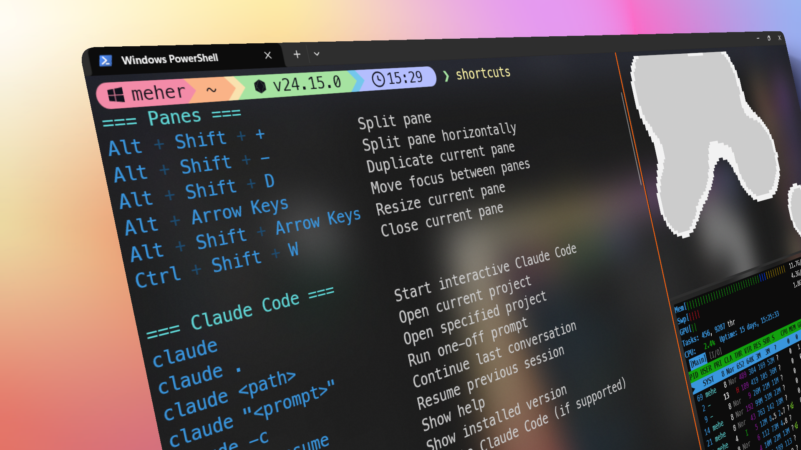

<div align="center">
  
  <h1>Shortcuts</h1>
  <p><em>Your personal keyboard-shortcut cheat sheet, one command away, in every shell</em></p>
</div>

<p align="center"><strong>one-line install · edit in your own editor · consistent output everywhere · zero runtime deps</strong></p>

<p align="center">
  
  
  
  
  
</p>

<p align="center">
  <a href="#installation">Installation</a> ·
  <a href="#quick-example">Quick example</a> ·
  <a href="#commands">Commands</a> ·
  <a href="#customization">Customization</a> ·
  <a href="https://suhaas-code.github.io/shortcuts-cmd/">Docs site</a>
</p>

---

## Introduction

You're in the middle of a task when your mind blanks on a shortcut. Split a
pane. Jump to the end of a line. Search scrollback. Instead of staying in flow,
you leave the terminal to search the web, or dig through notes or worse ask your AI,
and the interruption costs more than ease the shortcut ever provided.

**shortcuts** keeps what you need where you work. One command prints your
personal cheat sheet in a clean, aligned, colored layout; another searches it;
another opens it in your editor. Keep shortcuts, notes, IPs, or plaintext passwords anything you want
a glance away in your CLI.

Powered by a single plain-text file and one lightweight script per platform, it
works identically across PowerShell, cmd, Linux, macOS, WSL, and Git Bash. Fully
offline, zero dependencies, and updates only when you ask.

## Installation

**Windows** (PowerShell):

```powershell
irm https://github.com/Suhaas-code/shortcuts-cmd/releases/latest/download/install.ps1 | iex
```

**Linux · macOS · WSL · Git Bash**:

```bash
curl -fsSL https://github.com/Suhaas-code/shortcuts-cmd/releases/latest/download/install.sh | bash
```

The installer puts `shortcuts` on your `PATH` and seeds a default list matched
to your environment. Open a new terminal, or run the one-liner it prints to use
it in the current shell. Re-running is safe - it never overwrites your edits.

→ Full details, uninstalling, and file locations: **[docs/installation.md](docs/installation.md)**.

## Quick example

```
> shortcuts

=== Panes ===
Alt + Shift + +           Split pane
Alt + Shift + -           Split pane horizontally
Alt + Arrow Keys          Move focus between panes
...

> shortcuts search pane
=== Panes ===
Alt + Shift + +           Split pane
...

> shortcuts edit
Opening shortcuts in the default editor...
```



## Commands

| Command | What it does |
|---|---|
| `shortcuts` | Print your shortcuts |
| `shortcuts <page>` | Print a named page |
| `shortcuts new <name>` | Create a new page |
| `shortcuts rm <name> [-y]` | Delete a page |
| `shortcuts pages` | List pages |
| `shortcuts search <term>` | Filter by keyword — or by section heading to show the whole section |
| `shortcuts autoadd [-y]` | Detect installed CLI tools and add a starter shortcut section for each |
| `shortcuts edit [page]` | Open your shortcuts (or a named page) in your editor |
| `shortcuts path` | Print the data file path |
| `shortcuts reset [-y]` | Restore the default shortcuts |
| `shortcuts update` | Update the `shortcuts` script itself |
| `shortcuts version` | Neofetch-style banner: version, environment, counts |
| `shortcuts uninstall [-y]` | Remove shortcuts completely (script, config, PATH) |
| `shortcuts help` | Show help |

## Customization

Run `shortcuts edit` and make it yours. The data file is plain text — `#` for a
section, a Tab between a key and its description, and `` `backticks` `` to
highlight individual keys:

```
# Git
`git` `st`      status
`git` `co`      checkout
```

It also understands a Markdown-lite subset (`##` sub-headings, `**bold**` /
`*italic*`, `---` rules), per-file color themes via `// color` lines, and
`// ansi = off` to strip all styling for SSH/WSL sessions.

→ Format reference: **[docs/customization.md](docs/customization.md)** ·
Colors: **[docs/colors.md](docs/colors.md)**

## Documentation

Full docs, rendered: **[suhaas-code.github.io/shortcuts-cmd](https://suhaas-code.github.io/shortcuts-cmd/)**

- **[CLI Reference](docs/reference.md)** — every command, flags, and behavior
- **[Installation](docs/installation.md)** — install, uninstall, where files live
- **[Customization](docs/customization.md)** — data-file format and Markdown-lite
- **[Colors](docs/colors.md)** — theming and turning color off
- **[Architecture](docs/architecture.md)** — how it works, repo layout, releases
- **[Contributing](docs/contributing.md)** — developing and releasing
- **[Changelog](CHANGELOG.md)** — release history

## License

MIT — see [LICENSE](LICENSE).
